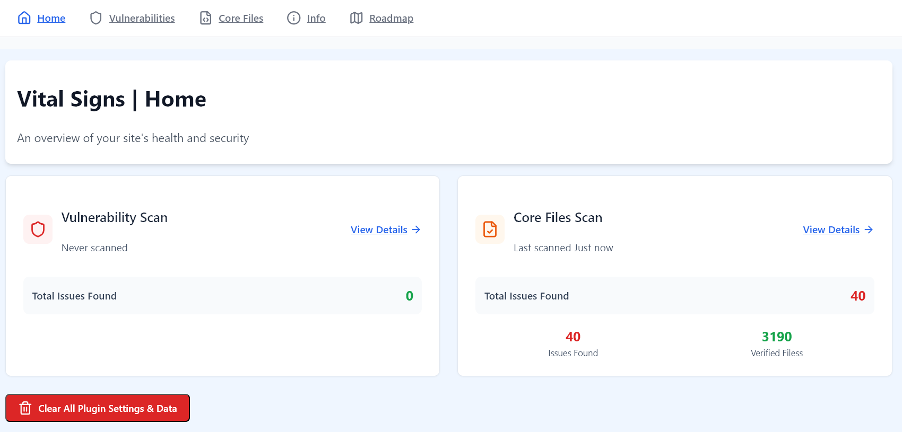
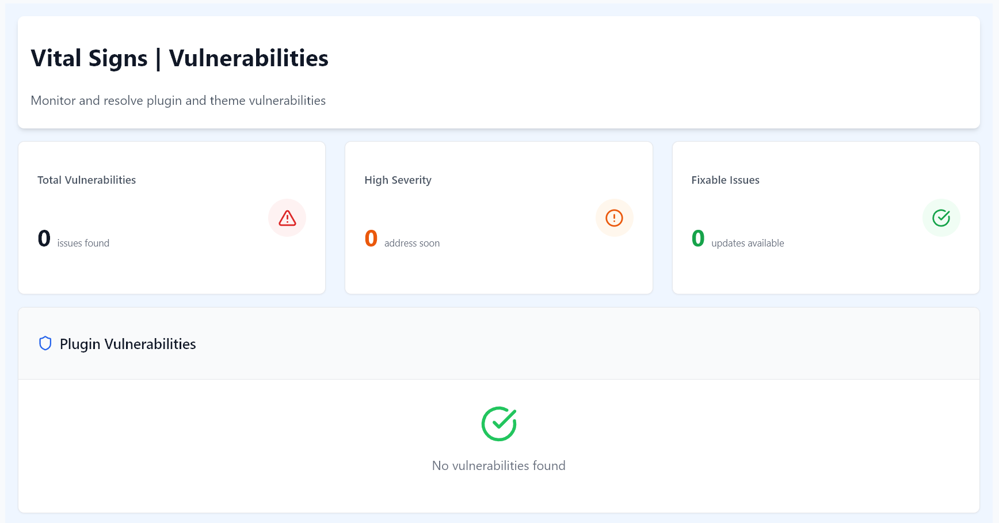
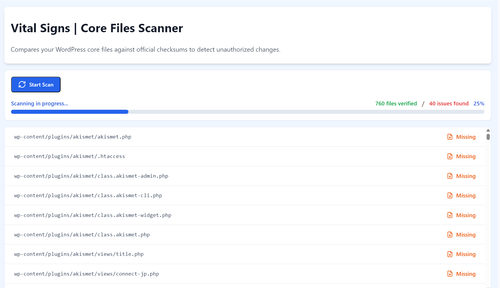
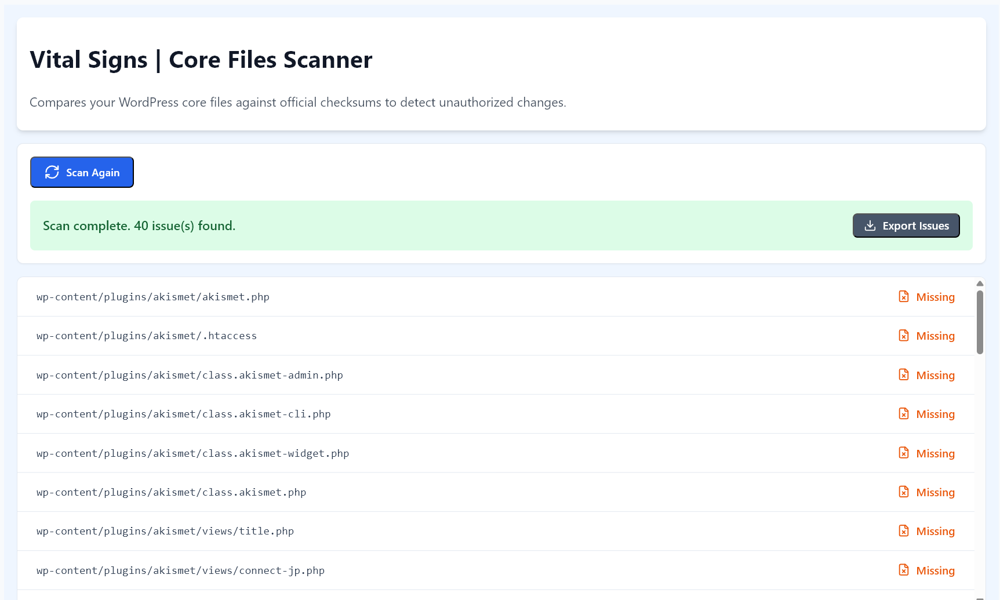
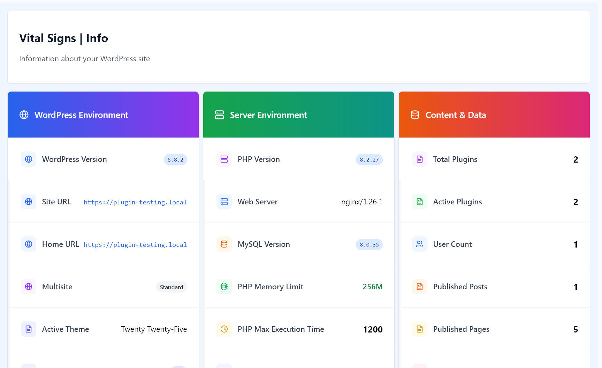

# Vital Signs for WordPress

[](https://wordpress.org/plugins/vital-signs)
[](https://wordpress.org)
[](https://www.gnu.org/licenses/gpl-2.0.html)

A lightweight yet powerful security and monitoring tool to keep your WordPress site healthy. Scan core files, check for vulnerabilities, and view a system status report, all from a clean, modern dashboard.

Vital Signs is built for site administrators who need a quick and reliable overview of their site's security posture without the bloat of heavier security plugins.

## Key Features

*   🛡️ **Vulnerability Scanner:** Scans all installed plugins and themes against a public vulnerability database to identify known security risks before they can be exploited.
*   📂 **Core File Integrity Scanner:** Compares your WordPress core files against official checksums from WordPress.org, instantly flagging any unauthorized additions, modifications, or deletions.
*   📊 **Comprehensive System Info:** Provides a detailed, one-page report of your WordPress and server environment, making it easy to debug issues or assess your site's configuration at a glance.
*   ✅ **Lightweight and Modern UI:** A fast, responsive interface built with React that makes security monitoring a seamless and intuitive experience.

## Screenshots

<table>
  <tr>
    <td align="center"><strong>Main Dashboard</strong></td>
    <td align="center"><strong>Vulnerability Scanner</strong></td>
  </tr>
  <tr>
    <td></td>
    <td></td>
  </tr>
  <tr>
    <td align="center"><strong>Core File Scanner (In Progress)</strong></td>
    <td align="center"><strong>Core File Scanner (Issues Found)</strong></td>
  </tr>
  <tr>
    <td></td>
    <td></td>
  </tr>
</table>

**Comprehensive System Status Report**


## Installation

#### From the WordPress Dashboard (Recommended)

1.  Navigate to `Plugins` > `Add New` in your WordPress admin panel.
2.  Search for "Vital Signs".
3.  Click `Install Now`, then `Activate`.
4.  Find the plugin's main page under the "Vital Signs" menu in your admin sidebar.

#### Manual Installation (from GitHub)

1.  Download the latest `.zip` file from the [Releases](https://github.com/your-username/vital-signs/releases) page.
2.  Navigate to `Plugins` > `Add New` in your WordPress admin panel.
3.  Click `Upload Plugin` and choose the `.zip` file you downloaded.
4.  Click `Install Now`, then `Activate`.

## Usage

Once activated, you can access all features from the main **Vital Signs** menu in your WordPress admin sidebar. The dashboard provides a high-level overview, and each feature has its own dedicated tab for more detailed information and actions.

## For Developers: Build Process

This plugin uses a modern JavaScript stack (React and Vite) for its admin interface. The source code is located in the `/src` directory.

To work with the source code, you'll need Node.js and npm installed.

1.  **Clone the repository:**
    ```shell
    git clone https://github.com/your-username/vital-signs.git
    cd vital-signs
    ```

2.  **Install dependencies:**
    ```shell
    npm install
    ```

3.  **Run the build process:**
    *   For development (with hot-reloading): `npm run dev`
    *   For production (minified assets): `npm run build`

The compiled production assets are generated in the `/build` directory, which is the code distributed in the WordPress plugin.

## A Note on Source Code (for WordPress.org Reviewers)

This plugin is built using modern development tools (NPM, Vite) to compile and minify its JavaScript assets for optimal performance. In compliance with the WordPress.org plugin guidelines, this public repository contains the complete, human-readable source code.

*   **Source Location:** The original, un-compiled JavaScript (React) and CSS source files are located in the `/src` directory.
*   **Build Instructions:** The process for compiling these source files into the production assets found in the `/build` directory is detailed in the "For Developers" section above.

## License

This plugin is licensed under the GPLv2 or later.
See the [LICENSE](LICENSE) file for more details.